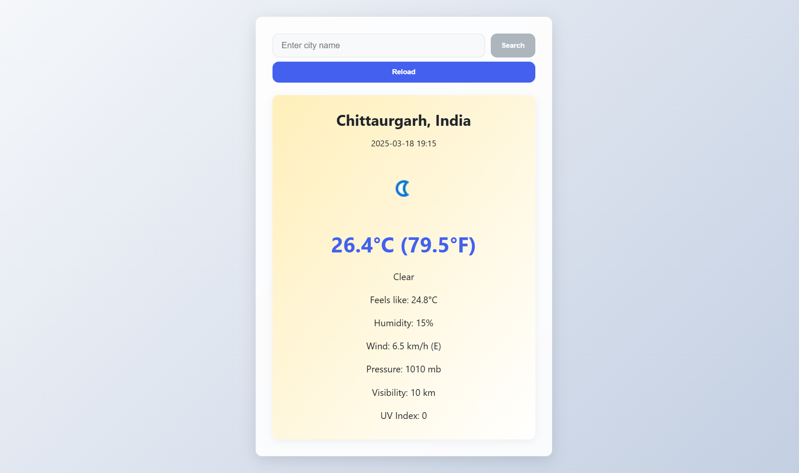

# ☀️ Modern Weather App

**Beautifully designed, real-time weather information at your fingertips**



## ✨ Features

- 🌍 **Geolocation Support** - Automatically detects your current location
- 🔍 **Smart Search** - Find any city with autocomplete suggestions
- 🌡️ **Comprehensive Data** - Temperature, humidity, wind, pressure, and more
- 📱 **Fully Responsive** - Perfect on desktop, tablet, and mobile
- 🎨 **Dynamic Styling** - Visual cues based on current weather conditions
- ⚡ **Fast & Lightweight** - Optimized for performance

## 🛠️ Built With


- [React](https://reactjs.org/) - Frontend framework
- [Weather API](https://www.weatherapi.com/) - Real-time weather data
- [Geolocation API](https://developer.mozilla.org/en-US/docs/Web/API/Geolocation_API) - Location detection

## 📋 Getting Started

### Prerequisites

- Node.js (v14 or later)
- npm or yarn

### Installation

1. Get your Weather API Key at [https://www.weatherapi.com/](https://www.weatherapi.com/)

2. Clone the repository

   ```sh
   git clone https://github.com/yourusername/React-Weather-App.git
   ```

3. Install NPM packages

   ```sh
   npm install
   ```

   or

   ```sh
   yarn install
   ```

4. Start the development server
   ```sh
   npm start
   ```
   or
   ```sh
   yarn start
   ```

## 🔍 Usage

**Current Location**  
Allow location access when prompted to see your local weather instantly.

**Search Any City**  
Type in the search bar to get autocomplete suggestions for cities worldwide.

**Weather Details**  
View comprehensive weather information including "feels like" temperature, humidity, wind speed and direction, and more.

**Refresh Data**  
Use the "Reload" button to get the latest weather updates.

## 🔗 Connect on LinkedIn  
Curious to see the **Wheather app** in action? Check out my LinkedIn post, where I showcase a video demo of the project! 🚀  

🎥 **Watch the demo here:** [LinkedIn Post](https://www.linkedin.com/posts/abhishek-soni-662028331_experience-weather-like-never-before-activity-7308792944126242816-hAoI?utm_source=share&utm_medium=member_desktop&rcm=ACoAAFN5q6oBYUN1lZGdeZiR4oHDbon9ejqNVRk)
